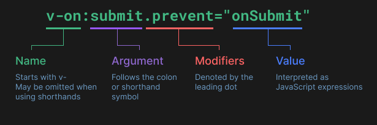

# Vue Documentation

> Introduction

- Vue = Javascript framework. 

- Main features: 
    - Declarative rendering (From javascript state it allows us to declaratively describe HTML output (?)).
    - Reactivity (As soon as Javascript changes Vue updates the DOM).

- SFC (Single File Components) --> logic (JS), Template (HTML), style (CSS) in a single file. https://vuejs.org/guide/scaling-up/sfc

- API Styles 
    - Options API: Object (data, methods, .mount) (Noob friendly)
    - Composition API: Imported API funcitons (requires more understanding of the reactiveness of Vue, it's more efficient while building complete apps)

        => **Which to choose?**

        The Options API is implemented on top of the Composition API (same underlying system)  

        - Options: Centered around *component instance* (.this). 
        - Composition: Centered around *Declaring reactive state variables in a function scope and composing multiple functions together*.  

> Template Syntax

- Vue sintax is based on HTML => the browser is able to read it 
- Vue compiles the template into highly efficient Js code 
- Mustaches '{{ message }}' : this syntax allows to substitute 'message' with the value of the property 'message', from the corresponding component instance 
- Directives (v-...) [Applies a reactive behaviour to the rendered DOM]
    - **v-html** = the value of the property (on which the attribute 'v-html' is applied) will be interpreted as plain HTML
    - **v-bind** = it keeps the attribute in sync with the components property 
    - **v-if** = it removes/inserts the HTML element is attached to based on the truthiness of the expression
    - **v-on** = event listener (@)
    - Dynamic argument: 

        <a v-bind[attrbuteName]="url"> ... </a>
    
- **Javascript expressions** 
    - Each binding can contain only one expression
    - Restricted global access

